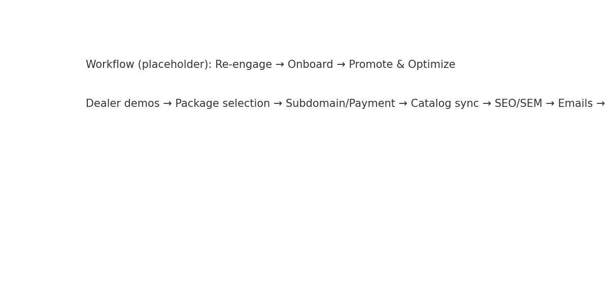

# Kia eCommerce Relaunch — Go-To-Market (Parts Department)


**Owner:** Blanca Blanco (IFM Americas) <bblanco@ifmamericas.com>  
**Audience:** Dealer Principals, Fixed Ops Directors, Parts & Service Managers  
**Purpose:** Boardroom-ready GTM plan and analytics for Kia Parts eCommerce relaunch.

---

## Table of Contents
- [Executive Summary](#executive-summary)
- [Why Relaunch & What’s Different](#why-relaunch--whats-different)
- [GTM Plan: 3 Phases (30–60–90)](#gtm-plan-3-phases-306090)
- [Program Evidence & Benchmarks](#program-evidence--benchmarks)
- [Pricing & Packaging](#pricing--packaging)
- [Operating Model & Cadence](#operating-model--cadence)
- [Data & Measurement Plan](#data--measurement-plan)
- [Risks & Mitigations](#risks--mitigations)
- [Workflow](#workflow)
- [How to Run the R Analytics](#how-to-run-the-r-analytics)
- [License](#license)

---

## Executive Summary
Kia Parts eCommerce is being relaunched with a proven playbook tailored for Fixed Ops. The goal is to increase online parts revenue, strengthen IRF/wholesale relationships, and improve customer retention. This repo contains a boardroom narrative, workflow, sample analytics (R), and presentation artifacts to support a fast, high-confidence rollout.

## Why Relaunch & What’s Different
- **IRF & Wholesale Integration**: Built to support Independent Repair Facilities and wholesale accounts.  
- **Streamlined Shipping**: Faster, dealer-controlled methods.  
- **Flat Monthly Fee**: No revenue share.  
- **SEO + SEM Included**: Visibility to qualified parts buyers.  
- **Quarterly Emails**: To DMS customers and conquest audiences.  
- **Local → National Reach**: 150 mi, 500 mi, or nationwide targeting.

## GTM Plan: 3 Phases (30–60–90)
1. **Re-Engage Dealers (Days 0–30)**: Outreach to parts managers, onsite/virtual demos, and process docs.  
2. **Onboard + Set Up (Days 31–60)**: IRF/wholesale module live; SEO + SEM configured; email campaigns prepped.  
3. **Promote + Optimize (Days 61–90)**: Conquest/retention emails, KPI tracking, and quarterly adjustments.

## Program Evidence & Benchmarks
Charts below are **samples** generated from synthetic data for illustration. Replace with live program data once available.

- 
- 
- 
- 
- 

## Pricing & Packaging
> Defaults — confirm with OEM/Kia Digital Program
- **Base**: $300/mo, $300 setup, no SEM.  
- **Base+Ad**: $1–3k SEM/mo.  
- **Advanced**: $3–7k SEM/mo.  
- **Pro**: Custom SEM + IRF/wholesale emphasis.

## Operating Model & Cadence
**RACI** and coaching cadence included in `/ops/rollout_checklist.md`. Weekly pipeline reviews, monthly KPI readouts, quarterly optimization, and email calendar.

## Data & Measurement Plan
- **Site Funnel**: Add-to-Cart, Begin-Checkout, Conversion Rate, Sales.  
- **Fixed Ops**: Parts Margin %, Fill Rate, Avg Revenue/Dealer, CSI/NPS.  
- Reporting cadence: weekly scorecard + quarterly QBR.

## Risks & Mitigations
- **Payment Gateway / Subdomain DNS / Catalog Sync**: Pre-flight checklist; test transactions; QA.  
- **Staffing/Turnover**: Playbooks, quick-start training, scripts, and KPI dashboards.  
- **Compliance**: PCI-compliant flows; data privacy practices.

## Workflow
Mermaid source: [`ops/workflow.mmd`](ops/workflow.mmd)  
Rendered PNG: 

## How to Run the R Analytics
1. Install R ≥ 4.2 and packages:
   ```r
   install.packages(c("tidyverse","scales","patchwork","gt"))
   ```
2. From repo root in R:
   ```r
   source("R/_render_all.R")
   ```
3. Charts render to `docs/figures/` as **PNG** and **SVG**. Re-run after data updates.

## License
Released under the **MIT License**. See [LICENSE](LICENSE).  
© Infomedia / IFM Americas — Internal/Confidential sample materials.
