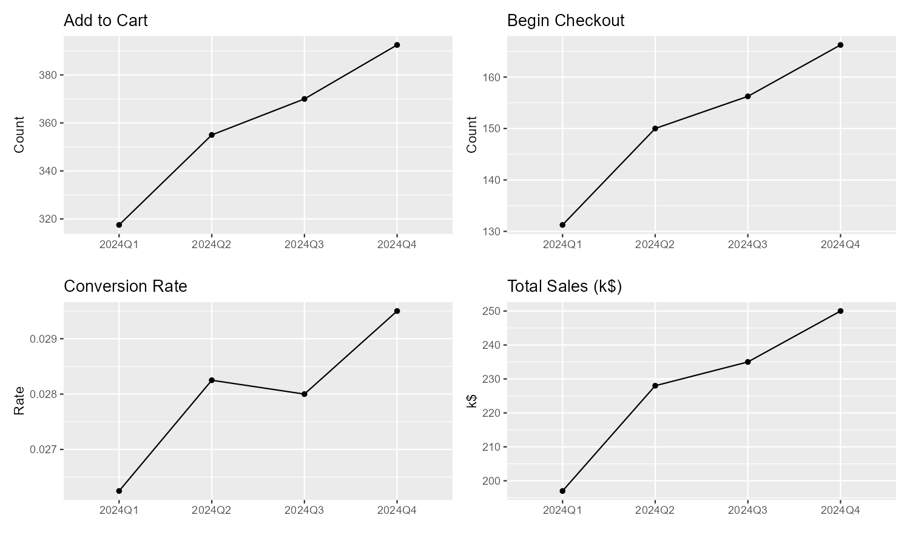
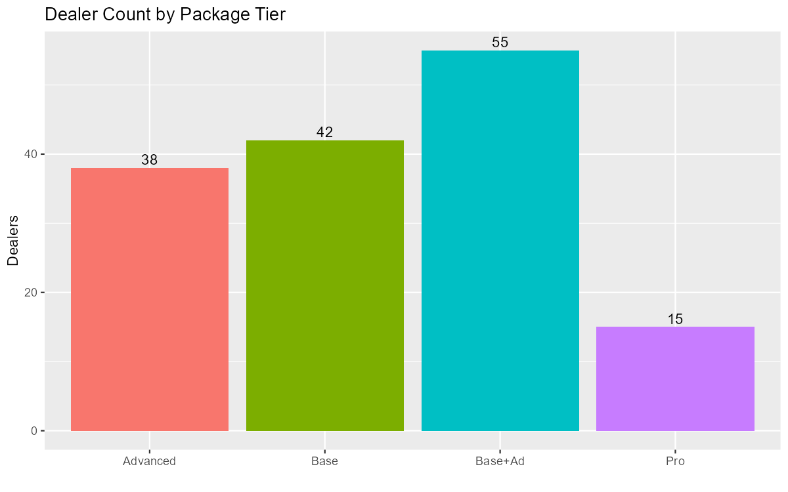
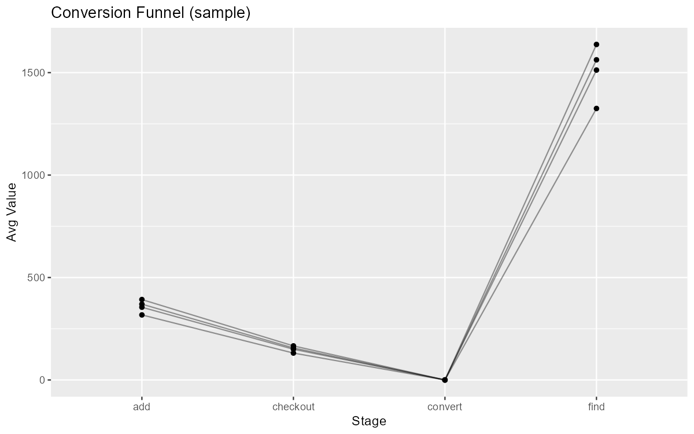
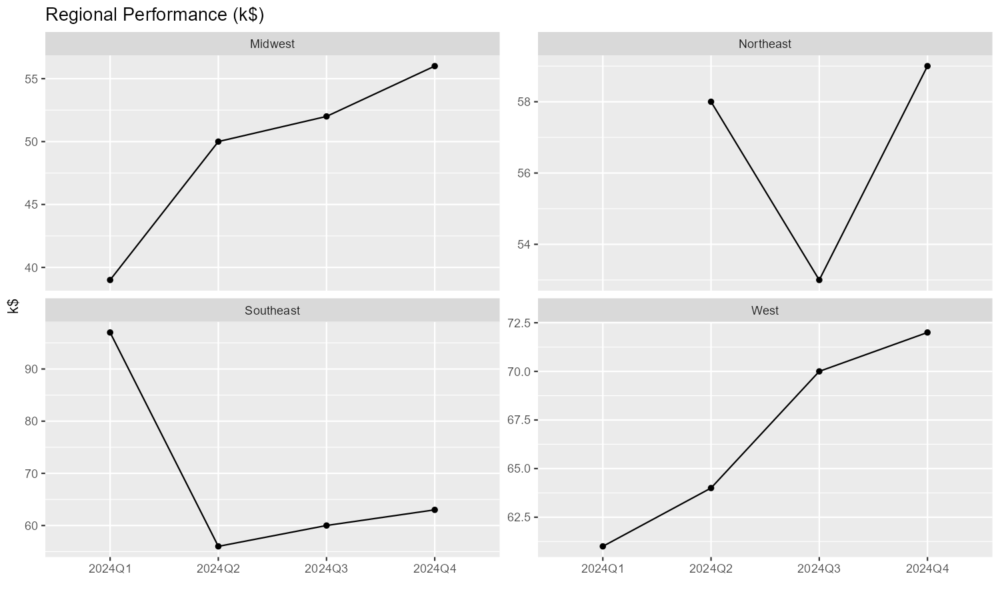
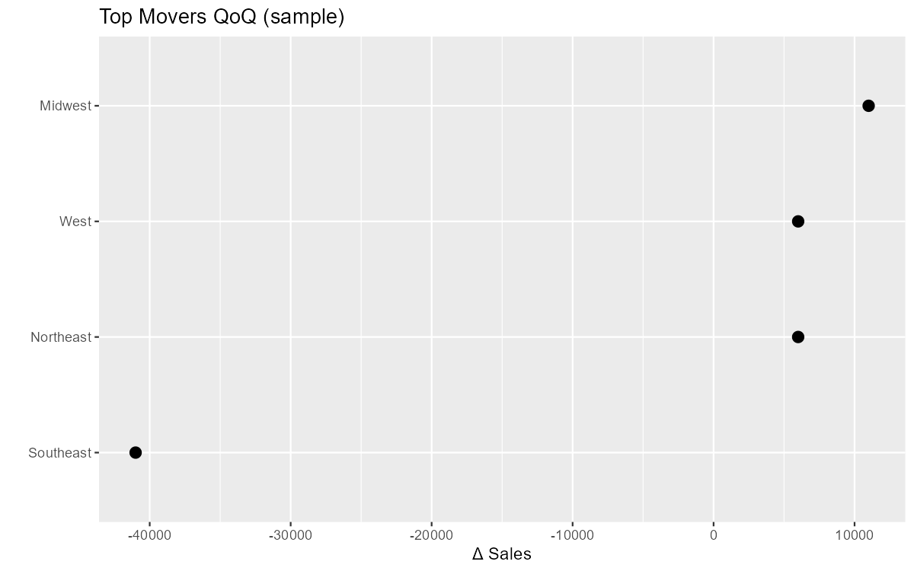

# Kia eCommerce Relaunch — Go-To-Market (Parts Department)


**Owner:** Blanca Blanco (IFM Americas) <bblanco@ifmamericas.com>  
**Audience:** Dealer Principals, Fixed Ops Directors, Parts & Service Managers  
**Purpose:** Boardroom-ready GTM plan and analytics for Kia Parts eCommerce relaunch.

---

## Table of Contents
- [Executive Summary](#executive-summary)
- [Why Relaunch & What’s Different](#why-relaunch--whats-different)
- [GTM Plan: 3 Phases (30–60–90)](#gtm-plan-3-phases-306090)
- [Program Evidence & Benchmarks](#program-evidence--benchmarks)
- [Pricing & Packaging](#pricing--packaging)
- [Operating Model & Cadence](#operating-model--cadence)
- [Data & Measurement Plan](#data--measurement-plan)
- [Risks & Mitigations](#risks--mitigations)
- [Workflow](#workflow)
- [How to Run the R Analytics](#how-to-run-the-r-analytics)
- [License](#license)

---

## Executive Summary
Kia Parts eCommerce is being relaunched with a proven playbook tailored for Fixed Ops. The goal is to increase online parts revenue, strengthen IRF/wholesale relationships, and improve customer retention. This repo contains a boardroom narrative, workflow, sample analytics (R), and presentation artifacts to support a fast, high-confidence rollout.

## Why Relaunch & What’s Different
- **IRF & Wholesale Integration**: Built to support Independent Repair Facilities and wholesale accounts.  
- **Streamlined Shipping**: Faster, dealer-controlled methods.  
- **Flat Monthly Fee**: No revenue share.  
- **SEO + SEM Included**: Visibility to qualified parts buyers.  
- **Quarterly Emails**: To DMS customers and conquest audiences.  
- **Local → National Reach**: 150 mi, 500 mi, or nationwide targeting.

## GTM Plan: 3 Phases (30–60–90)
1. **Re-Engage Dealers (Days 0–30)**: Outreach to parts managers, onsite/virtual demos, and process docs.  
2. **Onboard + Set Up (Days 31–60)**: IRF/wholesale module live; SEO + SEM configured; email campaigns prepped.  
3. **Promote + Optimize (Days 61–90)**: Conquest/retention emails, KPI tracking, and quarterly adjustments.

## Program Evidence & Benchmarks
Charts below are **samples** generated from synthetic data for illustration. Replace with live program data once available.

- 
- 
- 
- 
- 

## Pricing & Packaging
> Defaults — confirm with OEM/Kia Digital Program
- **Base**: $300/mo, $300 setup, no SEM.  
- **Base+Ad**: $1–3k SEM/mo.  
- **Advanced**: $3–7k SEM/mo.  
- **Pro**: Custom SEM + IRF/wholesale emphasis.

## Operating Model & Cadence
**RACI** and coaching cadence included in `/ops/rollout_checklist.md`. Weekly pipeline reviews, monthly KPI readouts, quarterly optimization, and email calendar.

## Data & Measurement Plan
- **Site Funnel**: Add-to-Cart, Begin-Checkout, Conversion Rate, Sales.  
- **Fixed Ops**: Parts Margin %, Fill Rate, Avg Revenue/Dealer, CSI/NPS.  
- Reporting cadence: weekly scorecard + quarterly QBR.

## Risks & Mitigations
- **Payment Gateway / Subdomain DNS / Catalog Sync**: Pre-flight checklist; test transactions; QA.  
- **Staffing/Turnover**: Playbooks, quick-start training, scripts, and KPI dashboards.  
- **Compliance**: PCI-compliant flows; data privacy practices.

## Workflow

Below are the live Mermaid diagrams embedded in this README. Source files live in `ops/` and optional exported images in `docs/workflow/`.

### End-to-End Flow (Advanced)

```mermaid
flowchart LR
%% Styles kept GitHub-safe (no rx/ry/newlines in labels)
classDef milestone fill:#111827,stroke:#111827,color:#ffffff
classDef decision  fill:#ffffff,stroke:#111827,stroke-width:2px
classDef ifm       fill:#eef6ff,stroke:#1d4ed8,color:#0f172a
classDef dealer    fill:#ecfdf5,stroke:#059669,color:#064e3b
classDef kia       fill:#f5f3ff,stroke:#7c3aed,color:#3b0764
classDef risk      fill:#fff7ed,stroke:#ea580c,color:#7c2d12

Start([Kickoff & Goals Aligned]):::milestone

subgraph P1[Phase 1 - Re-Engage Dealers (Days 0-30)]
direction LR
IFM1[Build target list & data pull]:::ifm --> IFM2[Outreach cadence & demo scheduling]:::ifm
IFM2 --> DEAL1[Identify stakeholders<br/>(Dealer Principal, Parts Manager, IT)]:::dealer
DEAL1 --> DEC1{Dealer signs program?}:::decision
DEC1 -- No --> NURT[Nurture sequence<br/>(quarterly touches)]:::ifm --> IFM2
DEC1 -- Yes --> P0[Provision project in tracker]:::ifm
end

Start --> IFM1

subgraph P2[Phase 2 - Onboard & Setup (Days 31-60)]
direction TB

subgraph LNA[A) Domain & Payments]
direction TB
DNS[Subdomain request + DNS CNAME/TXT]:::dealer --> PG[Payment gateway config<br/>(test $1 authorization)]:::dealer
PG --> DEC2{Gateway test passes?}:::decision
DEC2 -- No --> REMPG[Gateway remediation checklist]:::risk --> PG
end

subgraph LNB[B) Catalog & Data]
direction TB
CAT1[DMS/data integration]:::ifm --> CAT2[Pricing, tax, shipping rules]:::dealer --> CAT3[Fitment & catalog sync]:::ifm
CAT3 --> DEC3{Catalog QA pass (10 SKUs)?}:::decision
DEC3 -- No --> REMCAT[Map/attribute fixes]:::risk --> CAT3
end

subgraph LNC[C) Analytics & Compliance]
direction TB
GA4[GA4 + Ads conversion tags]:::ifm --> PCI[PCI/Privacy & data checklist]:::kia --> DASH[Ops dashboard provisioned]:::ifm
end

subgraph LND[D) Marketing Setup]
direction TB
SEO[SEO baseline + on-page fixes]:::ifm --> SEM[SEM templates + budgets]:::ifm --> EMAIL[Email lists (DMS) + creatives approval]:::dealer
end

P0 --> DNS
P0 --> CAT1
P0 --> GA4
P0 --> SEO

JOIN2([Go-Live Readiness Review]):::milestone
DEC2 --> JOIN2
DEC3 --> JOIN2
DASH --> JOIN2
EMAIL --> JOIN2
end

subgraph P3[Phase 3 - Promote & Optimize (Days 61-90)]
direction LR
GL([Go-Live Publish]):::milestone --> MON[Live monitoring & Day-1 triage]:::ifm --> KPI[Weekly KPI standup]:::ifm
GL --> EML[Retention + Conquest emails live]:::ifm --> KPI
GL --> ADS[SEM on + bid checks]:::ifm --> KPI
KPI --> AB[A/B tests (landing, menus, promos)]:::ifm
KPI --> IRF[IRF/Wholesale coaching & playbooks]:::ifm
AB --> DEC4{Quarterly review complete?}:::decision
IRF --> DEC4
DEC4 -- Gaps --> REMPLAN[Action plan: owners & dates]:::risk --> KPI
DEC4 -- Yes --> BOARD([Board update & next-quarter plan]):::milestone
end

JOIN2 --> GL
````

### 90-Day Plan (Gantt Calendar)

```mermaid
gantt
dateFormat  YYYY-MM-DD
title Kia eCommerce Relaunch - 90-Day Plan

section Phase 1 - Re-Engage (0-30)
Outreach & demos                  :active, p1a, 2025-09-01, 14d
Stakeholder alignment             :p1b, after p1a, 10d
Sign program (rolling)            :milestone, m1, 2025-09-20, 0d

section Phase 2 - Onboard & Setup (31-60)
Domain & gateway                  :p2a, 2025-09-21, 10d
Catalog & data QA                 :p2b, 2025-09-21, 14d
Analytics & compliance            :p2c, 2025-09-21, 10d
Marketing setup (SEO/SEM/Email)   :p2d, 2025-09-24, 12d
Go-Live readiness review          :milestone, m2, 2025-10-10, 0d

section Phase 3 - Promote & Optimize (61-90)
Go-Live publish                   :p3a, 2025-10-11, 1d
Monitoring & day-1 triage         :p3b, after p3a, 3d
Emails & SEM live                 :p3c, after p3a, 14d
Weekly KPI standups               :p3d, 2025-10-12, 21d
Quarterly review & plan           :milestone, m3, 2025-11-10, 0d
```

```
::contentReference[oaicite:0]{index=0}
```


## How to Run the R Analytics
1. Install R ≥ 4.2 and packages:
   ```r
   install.packages(c("tidyverse","scales","patchwork","gt"))
   ```
2. From repo root in R:
   ```r
   source("R/_render_all.R")
   ```
3. Charts render to `docs/figures/` as **PNG** and **SVG**. Re-run after data updates.

## License
Released under the **MIT License**. See [LICENSE](LICENSE).  
© Infomedia / IFM Americas — Internal/Confidential sample materials.
